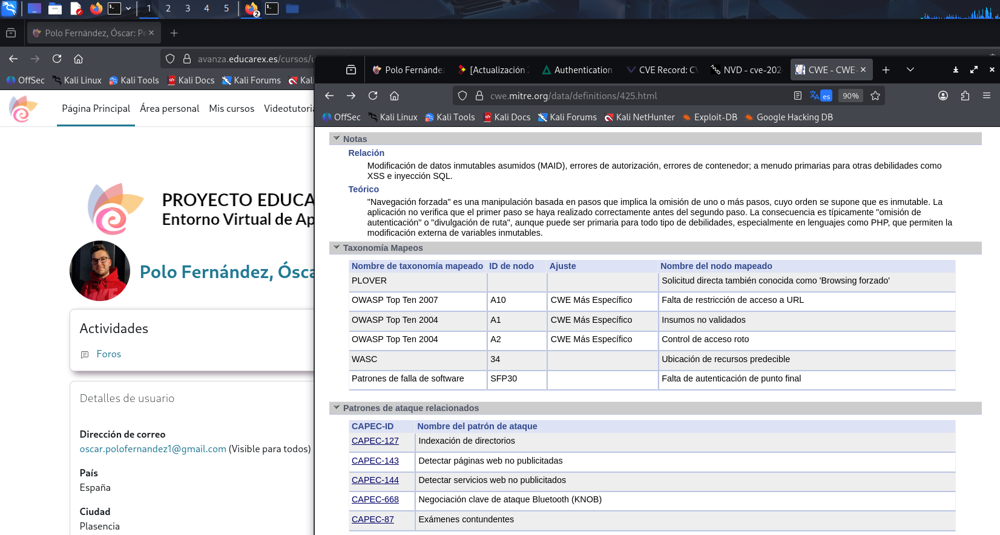
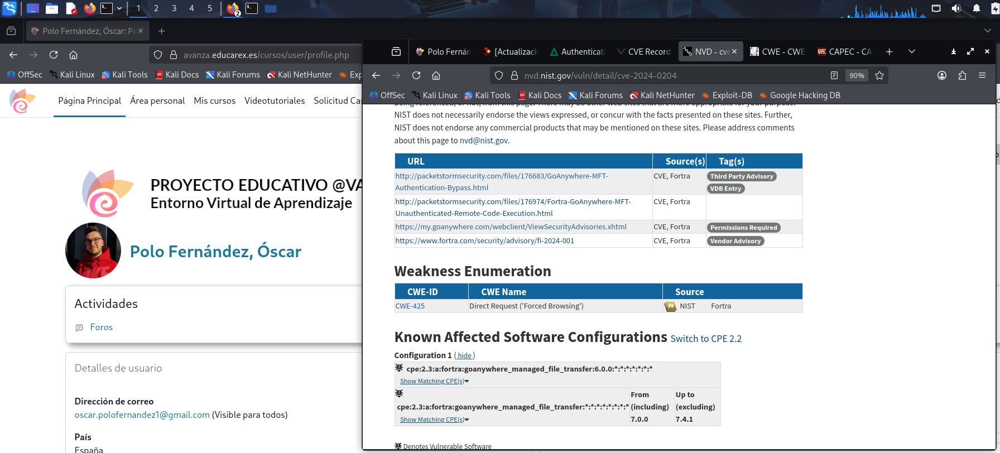

# Apartado 1 - Trazado de una vulnerabilidad

En este apartado muestro el desarrollo que he realizado de la [Actividad- TrazadoVulnerabilidad](https://github.com/jmmedinac03vjp/PuestaProduccionSegura/blob/main/Unidad2-NivelesSeguridad/Actividad-TrazadoVulnerabilidad/README.md).

El trazado de la vulnerabilidad de la que se informa en la actividad se corresponde a la de [este artículo](https://www.incibe.es/empresas/avisos/vulnerabilidad-critica-de-omision-de-autenticacion-en-goanywhere-mft-de-fortra) del [INCIBE](https://www.incibe.es/).

---

## 1. Trazado

Se informa de una vulnerabilidad crítica relacionada con la omisión de autenticación en [GoAnywhere MFT de Fortra](https://www.fortra.com/es/products/secure-managed-file-transfer-software). La fecha de publicación se corresponde al 24 de enero de 2024 y la importancia tiene un nivel 5, es decir, **crítica**.

La vulnerabilidad afecta desde la versión 6.0.1 hasta la 7.4.1.

También encuentro una descripción en la que se me indica que la vulnerabilidad permite a los ciberdelincuentes crear un usuario administrador a partir del portal de administración, eludiendo así los requisitos de autenticación en el acceso a un servicio.

Básicamente un ciberdelincuente puede crear un usuario con máximos privilegios a través de este portal de administración, con lo que ello supone.

Se indica la solución, que sería actualizar a la versión 7.4.1 o superior o eliminar el archivo _InitialAccountSetup.xhtml_ en el directorio de instalación en caso de despliegues sin contenedor. Con despliegues en contenedor, habría que reemplazar dicho archivo por uno limpio y reiniciar.

Se aportan enlaces para obtener más información desde el portal de clientes de GoAnywhere.

---

## 2. Información sobre las vulnerabilidades

En este punto, sé a qué elementos afecta la vulnerabilidad, pero no tengo enlace para dirigirme a las diferentes listas, por lo que me iré al enlace del apartado de "referencias" del artículo: [enlace referencia](https://www.fortra.com/security/advisories/product-security/fi-2024-001).

En la referencia, se vuelve a describir que la vulnerabilidad se debe a un _Bypass_ que pueden realizar los ciberdelicuentes desde el portal de administración. También se indica la severidad, el impacto que tiene y las soluciones. Básicamente, lo mismo que se muesta en el artículo del INCIBE.

Lo que encuentro aquí es la identificación de una única vulnerabilidad, ya se indica un único [CVE](https://www.incibe.es/incibe-cert/alerta-temprana/vulnerabilidades). 

- CVE es una lista mantenida por el [MITRE](https://attack.mitre.org/) en donde, cuando alguien encuentra una vulnerabilidad envía un reporte y ellos la estudian para determinar si ya está reportada o no, y en tal caso, asignarle un número identificativo. Este número consistiría en CVE, seguido del número de año y un número correlativo.

En este punto, tengo la vulnerabilidad **CVE-2024-0204**.

---

## 3. Información sobre el riesgo o criticidad de una vulnerabilidad

Ahora lo que haré será buscar la vulnerabilidad en el [MITTRE](https://www.cve.org/CVERecord?id=CVE-2024-0204) y en la base de datos del gobierno de Estados Unidos, la [NVD](https://nvd.nist.gov/vuln/detail/cve-2024-0204).

Indico que, en ambos sitios, la información obtenida es muy similar.

* **NVD**

Encuentro la descripción de la vulnerabilidad y la métrica. La métrica es la forma de calcular el nivel de criticidad de la vulnerabilidad (CVSS).

Si me fijo en el CVSS, puedo observar que depende de varios factores:

- Vector de ataque: Se trata de la facilidad del vector de ataque, que varía. Por ejemplo, no sería lo mismo necesitar acceso físico al ordenador para realizar el ataque que realizarlo desde cualquier sitio, a través de la red. En este caso se realiza desde la red.
- Complejidad del ataque: Se trata de ver si es sencillo realizarlo o no. En este caso es la complejidad es baja.
- Privilegios: Son la cantidad de privilegios que se requieren para hacer el ataque. Por ejemplo, no sería lo mismo necesitar ser un usuario logeado para hacerlo que hacerlo desde "fuera". En este caso no se necesitan privilegios.
- Inteacción con el usuario: Está más limitado el poder hacerlo con un usuario que realizarlo con una herramienta automática. En este caso no se requiere interación con el usuario.
- Confidencialidad, integridad y disponibilidad: Afecta a los tres pilares fundamentales de la ciberseguridad de manera muy alta.
- Conocimiento: Si es conocida la vulnerabilidad, tiene más impacto que si no lo es. En este caso tiene un 5.9 de impacto.

Con todos estos factores, se ha determinado que la vulnerabilidad sea crítica, con un 9.8.

En la lista de debilidades encuentro una debilidad que afecta a la vulnerabilidad encontrada:

* [CWE-425](https://cwe.mitre.org/data/definitions/425.html): Solicitud directa (navegación forzada).

* ** MITTRE**

En el MITTRE encuentro información muy similar a la de la NVD, pero con menos detalles. Por ejemplo, en la métrica, no se detallan los factores para calcular la criticidad de la vulnerabilidad.

La debilidad coincide con la de la NVD.

---

## 4. Información sobre patrones de ataque 

Sigo realizando la trazabilidad desde el enlace de la debilidad [CWE](https://cwe.mitre.org/data/definitions/425.html).

Destacar que realizo la consulta en la vista "Completa".

El [CWE](https://cwe.mitre.org/) forma parte del MITTRE y se encarga de recopilar información de las debilidades.

Se indica en la descripción de la debilidad qe la aplicación web mo hace cumplir adecuadamente la autorización en todas las URL, _scripts_ o archivos restringidos. LAs aplicaciones web susceptibles a estos ataques hacen una falsa suposición de que tales recursos solo se pueden alcanzar a través de una ruta de navegación determinada y solo aplican autorización en ciertos puntos.

Se muestran las mitigaciones a esta debilidad:

1. Aplicar autorizaciones de control de acceso para cada acceso a todas las URL, _scripts_ o archivos restringidos.
2. Hacer uso de marcos basados en MVC como [Struts](https://www.incibe.es/).

Se muestran las relaciones. Están indicados los diferentes ID correspondientes a las debilidades asociadas, junto a su naturaleza, descripción y tipo (si pongo el cursor sobre el tipo, se muestra información más detallada).

Se muestra un único ejemplo de cómo sería posible la navegación forzada y una lista de ejemplos para entender las variedades de formas en las que se puede introducir la debilidad, con sus correspondientes CVE.

Se muestran los diferentes CAPEC, que son los patrones de ataque para atacar la debilidad.

Los diferentes patrones de ataque que encuentro en esta debilidad son los siguientes:

* [CAPEC-127](https://capec.mitre.org/data/definitions/127.html): Indexación de directorios
* [CAPEC-143](https://capec.mitre.org/data/definitions/143.html): Detectar páginas web no publicitadas
* [CAPEC-144](https://capec.mitre.org/data/definitions/144.html): Detectar servicios de web no publicitados
* [CAPEC-668](https://capec.mitre.org/data/definitions/668.html): Negociación clave de ataque Bluetooth (KNOB)
* [CAPEC-87](https://capec.mitre.org/data/definitions/87.html): Exámenes contundentes

En el siguiente vídeo muestro el CAPEC-127. Todos los CAPEC tienen prácticamente los mismos apartados en los que:

[CAPEC](https://drive.google.com/file/d/1JAqX_Jc0p_QX3EAS88sXgf_CmrRAEEPA/view?usp=sharing)

1. Se muestra una descripción del patrón de ataque.
2. Se muestra una probabilidad de ataque.
3. Se le da un valor a la gravedad del ataque.
4. Se muestran relaciones con otros patrones de ataque.
5. Se explica el flujo de ejecución (exploración, experimentación y exploit).
6. Se dan los requisitos previos.
7. Se especifican las habilidades requeridas para ejecutarlo.
8. Se muestran los recursos requeridos.
9. Se muestan las consecuencias.
10. Se indican las mitigaciones.
11. Se dan ejemplos de escenarios.
12. Se muestran debilidades relacionadas con su correspondiente CWE.
13. Se muesta un mapeo de la taxonomía y referencias.

---

## 5. Consulta CPE

Llegado a este punto, he relacionado tres listas, la de vulnerabilidades (CVE - MITTRE / NVD), la de vulnerabilidades (CWE) y la de patrones de ataque (CAPEC).

Adicionalmente, puedo consultar las listas (CPE) del NVD. Son listas de las configuraciones de _software_ conocidas.

Es una estructura establecida que nos indica los elementos afectados. (CPE:version:fabricante:software:componentes)

El CPE sirve para herramientas automatizadas. Los diferentes programas de detección y explotación de vulnerabilidades se intercambian información a través de registros, y gracias a estos CPE podemos ver qué elementos son susceptibles de ataques.

---

## 6. Registro CVE

Descarga del Registro CVE De la vulnerabilidad

Toda la información obtenida para intercambiar o añadir a diferentes programas de explotación o detección de vulnerabilidades, o que directamente va a bases de datos la podemos descargar en formato de JSON. De esta forma tendremos acceso a toda la información y será interpretable entre los diferentes programas que utilizamos para detectar, atacar, etc.

Para descargar el JSON de la vulnerabilidad de la actividad, en la parte superior derecha del [CVE](https://www.cve.org/CVERecord?id=CVE-2024-0204) clicamos sobre "View JSON":

A continuación dejo una captura de pantalla con la vista del JSON. Podemos observar diferente información acerca de la debilidad (versión, ID, CVE, CWS...):

Descargar JSON:

* [Archivo JSON](JSON/CVE-2024-0204.json)
