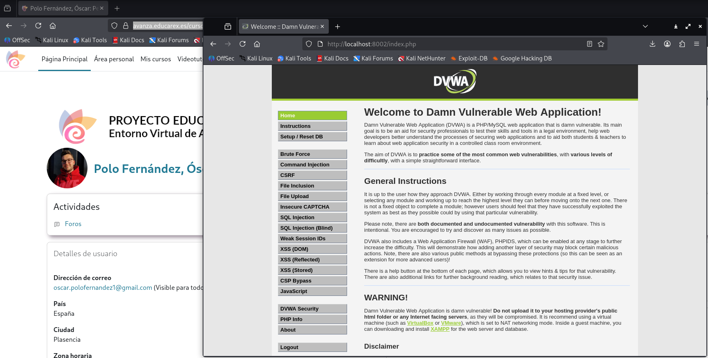
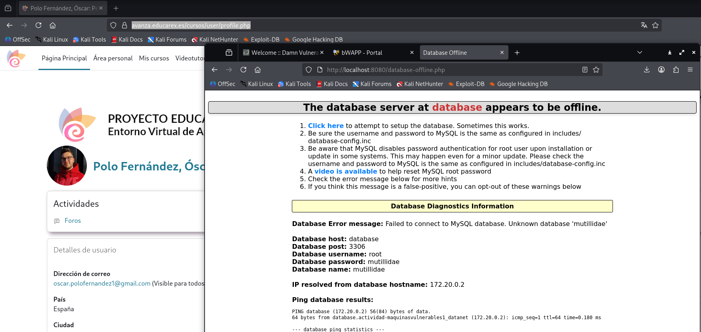
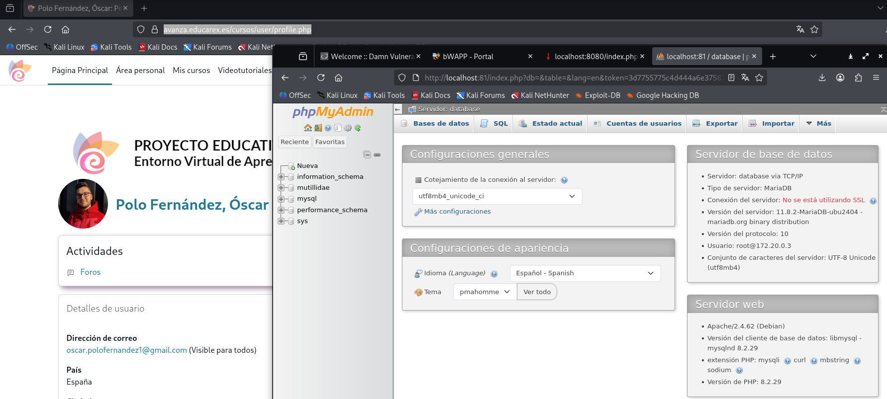
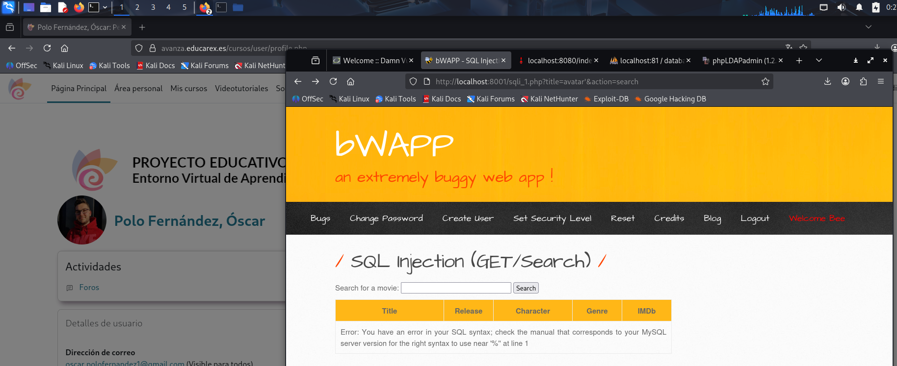
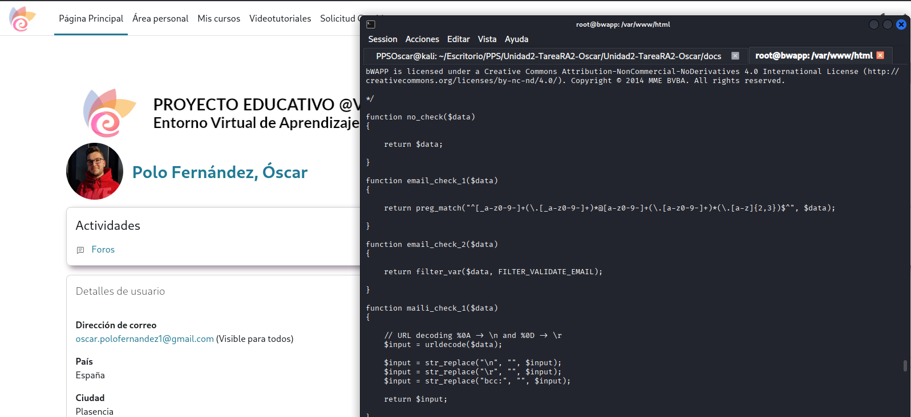
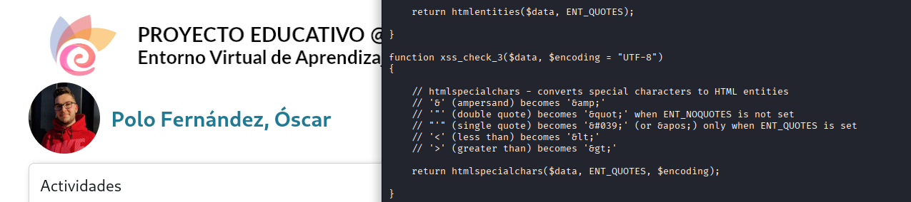

# Apartado 2 - Creación de entorno de máquinas vulnerables para pruebas.

En este apartado muestro cómo he realizado el desarrollo de la [Actividad- TrazadoVulnerabilidad](https://github.com/jmmedinac03vjp/PuestaProduccionSegura/blob/main/Unidad2-NivelesSeguridad/Actividad-MaquinasVulnerables/README.md).

En el [apartado 1](doc/TrazadoVulnerabilidadGoAnywhere.md) he realizado el trazado de una vulnerabilidad, buscando información de una vulnerabiliad concreta y sus debilidades en las diferentes fuentes web abiertas. En esta actividad me centro en desplegar un entorno con un conjunto de máquinas para probar los ataques y poder ver también cómo se securizan.

---

## 1. Entorno de máquinas virtuales

En primer lugar, voy a explicar las diferentes máquinas que hay en el archivo [docker-compose.yml](https://github.com/jmmedinac03vjp/PuestaProduccionSegura/blob/main/Unidad2-NivelesSeguridad/Actividad-MaquinasVulnerables/Files/docker-compose.yml).

Este archivo le tengo en el directorio desde el que voy a trabajar esta actividad y desde el cual voy a desplegar el contenedor (_/home/PPSOscar/Escritorio/PPS/Unidad2/Actividad-MaquinasVulnerables1_).

En este primer grupo tengo tres máquinas:

1. DVWA
    1. imagen de dvwa
    2. contenedor dvwa
    3. hostname mismo que el contenedor
    4. redirección de puertos al 8002 (por el que voy a acceder a la máquina)
    5. red labpps-net
2. BWAPP
    1. imagen de bwapp
    2. contenedor bwapp
    3. hostname mismo que el contenedor
    4. redirección de puertos al 8001 (por el que voy a acceder a la máquina)
    5. red labpps-net
3. KALI
    1. imagen de kali
    2. contenedor kali
    3. hostname mismo que el contenedor
    4. volumen bind mount (kali-volume)  que se montará en /root/kali
    5. red labpps-net

En el segundo grupo encuentro varios contenedores:

1. Base de datos
2. Base de datos de administrador accesible a través del puerto 81
3. Máquina www (servidor web)
    1. Tenemos una serie de puertos abiertos
    2. Utiliza dos redes (datanet / labpps-net), para conectarse con nuestra máquina y con la base de datos
4. Directory. Es un [LDAP](https://www.fortinet.com/lat/resources/cyberglossary/ldap-authentication). Accesinle mediante el puerto 389.
5. Directory admin accesible a través del puerto 82.

En el tercer grupo tenemos los segmetnos de las redes:

1. Encontramos las dos redes utilizadas.
2. Tenemos los volúmenes utilizados

---

## 2. Despliegue de escenario

A continuación lo que hago es desplegar el escenario del contenedor (_docker compose up -d_).

Lo primero que hago  es descargar todas las imágenes.

---

## 3. Acceso a las máquinas y creación de bases de datos

Seguidamente, abriré las diferentes máquinas vulnerables.

* DWA: A través de localhost:8002 (usuario admin / contraseña password)

Lo primero que me dice es que tengo que inicializar la base de datos.

Una vez creada la base de datos, ya tengo disponibles las instrucciones y los diferentes ataques a poder realizar.

* bWAPP: A través de localhost:8001 (usuario bee / contraseña bug) 

La primera vez que accedo da error porque no tiene creada la base de datos. Se crea accediendo a [creación base de datos](http://localhost:8001/install.php)

Desde esta máquina tengo acceso a varios ataques (ver listado) y puedo seleccionar la dificultad de los ataques.

* OWASP Multillidae: A través de localhost:8080 o localhost:80 (sin usuario ni contraseña)

La primera vez que accedo se pide crear la bases de datos.

Una vez creada la base de datos puedo acceder a las diferentes ataques y las diferentes vulnerabilidades añadidas en distintos años.

* phpAdmin

Puedo acceder a la base de datos (panel de administración de [phpMyAdmin](https://www.phpmyadmin.net/)) para crear registos, modificar base de datos, etc. A través de localhost:81

* PhpLdapAdmin

Puedo acceder también a PhpLdapAdmin, desde donde puedo modificar el servidor LDAP. A través de localhost:82

---

## 4. Análisis de vulnerabilidad

Llegado a este punto, el escenadrio multi contenedor está ya creado. Paso ahora a analizar determinados ataques y ver la securización y elementos utilizados para securizar.

Voy a realizar un ataque _SQL Injection (Get/Search)_. Esta vulnerabilidad ocurre cuando una aplicación web inserta directamente lo que escribe el usuario dentro de una consulta SQL, sin validarlo ni protegerlo.

En el caso del buscador de películas de bWAPP, el usuario escribe algo en el buscador y ese texto se envía por la URL mediante el método GET. El servidor construye una consulta SQL usando directamente ese texto, y si no hay protección, el usuario puede modificar directamente la consulta SQL original.

Hago un ejemplo conceptual para que se entienda mejor:

- Internamente la aplicación hace algo así:

_SELECT * FROM movies WHERE title LIKE '%avatar%';_

El problema surge cuando se escriben caracteres especiales como por ejemplo _'_. Hace que la consulta se rompa y demuestra que la aplicación no filtra ni escapa correctamente la entrada. Se devuelve texto de error de sintaxis.

Ahora, inspeccionaré el código que trata el input para ver qué está haciendo la aplicación.

Se puede ver en la URL que el código duente que he ejecutado es sqli 1.php. Accedo al contenedor de bWAPP (_docker exec -it bwapp /bin/bash_) y muestro el contenido del archivo (_nano /var/www/html/sqli1.php_).

Aquí se muestra la función con lo que se ha de realizar en base al nivel de seguridad que hayamos establecido en bWAPP. Con el nivel de seguridad más bajo, el 0, lo que hace la función es llamar a la función no_check(). Con otros niveles de seguridad se llama a las funciones xsscheck1 y xsscheck3.

- Indico enlace para descargar archivo completo y poder revisarlo: <a href="php/sqli_1.php" download> Descargar sqli_1.php </a>

En alguno de los siguientes módulos es donde se encuentran las funciones.

Busco con _grep_ para localizar los ficheros en los que aparece y la línea

Las funciones se encontraron en el archivo functions_external.php, en las líneas 19, 88 y 115.

La función devuelve un dato en _$data_ y lo devuelve exactamente igual, sin validar ni filtrar ni limpiar ni proteger. No hace ningún tipo de comprobación de seguridad. En una aplicación seguria, antes de usar lo que el usuario escribe, se haría algo como eliminar comillas, escapar caracteres especiales, validar la longitud o usar consultas preparadas.

- Dejo enlace para descargar el archivo completo <a href="php/function_external.php" download> Descargar function_external.php </a>

En caso de que se utilizase seguridad media, La función xss_check_1() aplica un filtrado insuficiente, ya que únicamente convierte los caracteres mayor que (<) y menor que (<) a entidades HTML. Además, posteriormente aplica urldecode(), lo que permite que un atacante utilice codificación URL para evadir el filtrado. Como consecuencia, es posible introducir código malicioso que será decodificado y ejecutado por el navegador, manteniendo la vulnerabilidad XSS. 

En caso de utilizar seguridad alta, La función xss_check_3() implementa una mitigación adecuada frente a ataques XSS mediante el uso de htmlspecialchars() con la opción ENT_QUOTES y codificación UTF-8. De esta forma, todos los caracteres especiales potencialmente peligrosos (<, >, ", ', &) se convierten en entidades HTML, impidiendo que el navegador los interprete como código ejecutable. A diferencia de las funciones anteriores, esta implementación sí representa una defensa correcta frente a XSS reflejado.

